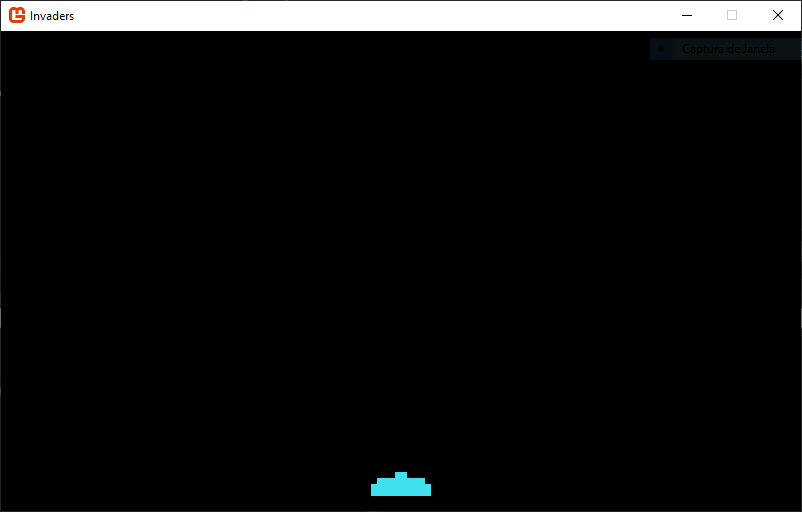

# Invaders
Clone de Space invaders feito para aprender desenvolvimento de jogos utilizando 
*Entity Component System* (ECS).

## ECS
ECS é um padrão de arquitetura de software.  
Um ECS é composto de *entidades* que possui *componentes* e um *sistema* opera 
os componentes das entidades.

---

# Desenvolvimento

## Dia 1

- Foi desenvolvida a classe base `Entity` que possui todos os componentes comuns às 
diferentes entidades do jogo como Posição, Imagem de Sprite, etc.  
Uma função abstrata `Update()` é definida e deve ser implementada nas classes filhas (herdeiras).
Aqui também é controlado se uma entidade precisar ser destruída (removida da lista de entidades)
através da propriedade `isExpired`.

- Foi desenvolvida a classe estática `EntityManager` em que **registra** e **armazena** todas as entidades 
do jogo. Ela também é responsável por **chamar os métodos `Draw()` e `Update()`** de todas as entidades.  
Ao se adicionar uma entidade, é importante verificar se o método `Update()` está ocorrendo. 
Se sim, adicionar essa entidade à uma fila e só adicionar à lista de entidades após o `Update()` 
ter sido concluído.  
Isso é importante para evitar modificações na lista de entidades durante sua atualização, porque
erros podem ocorrer.
Nossa implementação leva isso em conta.

- Desenvolvemos a classe estática `Art` que armazena todos os sprites que queremos utilizar no jogo.

- Adicionamos a classe `PlayerShip` que será nossa primeira entidade.
Portanto ela herda de `Entity` e define todos os atributos em seu construtor (posição, sprite, etc).  
O método `Update()` deve ser implementado.
 
Em `EntityManager`, o método `Update()` deve ser colocado em `GameRoot -> Update()`, 
após a chamada da classe base:
```csharp
protected override void Update(GameTime gameTime)
{
    ...
    base.Update(gameTime);
    EntityManager.Update();
}
```

Os sprites devem ser carregados no método `GameRoot -> LoadContent()`:

```csharp
protected override void LoadContent()
{
    _spriteBatch = new SpriteBatch(GraphicsDevice);
    Art.Load(Content);
}
```

Nossa nave (`PlayerShip`) é um *Singleton*, e deve ficar em `GameRoot -> Initialize()`:
```csharp
 protected override void Initialize()
 {
     base.Initialize();
     EntityManager.Add(new PlayerShip());
 }
```

E, finalmente, chamamos `EntityManager -> Draw()` em `GameRoot -> Draw()`:
```csharp

protected override void Draw(GameTime gameTime)
{
    GraphicsDevice.Clear(Color.Black);

    _spriteBatch.Begin(SpriteSortMode.Texture, BlendState.Additive);
    EntityManager.Draw(_spriteBatch);
    _spriteBatch.End();

    base.Draw(gameTime);
}
```

Como estamos utilizando o `EntityManager`, garantimos que os métodos `Update()` e `Draw()` 
de **todas** as entidades são executados.

Temos nossa estrutura básica pronta para adicionar, atualizar e exibir entidades. 
Nada muito excitante mas já podemos ver nossa nave:



## Dia 2
